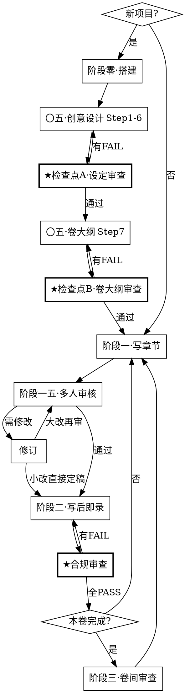
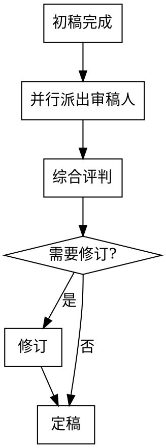

# 长篇小说写作工作流

管理百万字级长篇小说项目的完整工作流。基于纯 Markdown 文件夹，覆盖记忆系统初始化、写作技法存储、AI 上下文注入和持续维护。

## 适用场景

- 开始一个新的小说项目（初始化记忆系统）
- 用 AI 辅助写章节（上下文注入）
- 追踪伏笔、冲突、钩子、节奏
- 每章和每卷的维护更新
- **不适用**：短篇小说、非虚构写作、诗歌

## 内置参考文件

本技能自带以下参考文件，**Claude 写作时必须读取并遵循**，它们不会复制到用户项目中：

| 文件 | 路径 | 用途 |
|------|------|------|
| 记忆系统参考 | [references/memory-system.md](references/memory-system.md) | 目录结构、模板、AI 上下文策略 |
| 写作技法摘要 | [references/writing-techniques.md](references/writing-techniques.md) | 技法分类速查 |
| 伏笔类型与手法 | [references/伏笔类型与手法.md](references/伏笔类型与手法.md) | 6 种埋设手法、三拍节奏、自查清单 |
| 冲突类型手册 | [references/冲突类型手册.md](references/冲突类型手册.md) | 7 种冲突类型、升级阶梯、组合策略 |
| 悬念技法手册 | [references/悬念技法手册.md](references/悬念技法手册.md) | 4 种悬念机制、7 种章末钩子 |
| 节奏控制手册 | [references/节奏控制手册.md](references/节奏控制手册.md) | 爽点公式、张力曲线、节奏调节 |
| Scene-Sequel 模型 | [references/Scene-Sequel模型.md](references/Scene-Sequel模型.md) | Dwight Swain 场景结构 |
| MRU 参考 | [references/MRU参考.md](references/MRU参考.md) | 动机-反应单元、展示代替叙述、对话技巧、感官描写、写作修正技法 |
| 叙事装置手册 | [references/叙事装置手册.md](references/叙事装置手册.md) | 信息控制、结构装置、转折装置 |
| 爽点虐点设计手册 | [references/爽点虐点设计手册.md](references/爽点虐点设计手册.md) | 爽/虐/燃/泪四种情绪点 |
| 去AI味指南 | [references/去AI味指南.md](references/去AI味指南.md) | AI 指纹检测：高频废词、AI句式、段落修饰通病、句法节奏、自查清单 |
| 设定整合审查 | [references/设定整合审查.md](references/设定整合审查.md) | 检查点 A：逻辑一致性、角色-剧情匹配、可写性 |
| 卷大纲审查 | [references/卷大纲审查.md](references/卷大纲审查.md) | 检查点 B：技法、设定一致性、读者体验 |
| 写后即录合规审查 | [references/写后即录合规审查.md](references/写后即录合规审查.md) | 7 项机械化存在性/一致性检查 |
| Lint 规则目录 | [references/lint-规则目录.md](references/lint-规则目录.md) | CH-*/PR-* 全部规则 ID、阈值、门禁策略 |

**使用规则**：
- 写作辅助时，根据当前任务按需读取对应教材。**去AI味指南在所有涉及文本产出的阶段都必须读取**（包括阶段〇·五创意设计、阶段一写作、阶段一·五审核）。
- 审查类文件在对应检查点触发时读取，不在写作时加载。

### 工作流追踪文件

本技能在关键工作流节点**强制生成追踪文件**，确保多步骤流程逐项执行、逐项打勾，杜绝遗漏。

**机制**：每个追踪文件从 `_模板/工作流-*.md` 复制到用户项目 `00-项目/工作流/` 目录，agent 按 checkbox 逐项执行并标记完成。

**状态流转**：`待执行 → 进行中 → 通过 / 未通过`

| 模板文件 | 触发时机 | 生成文件命名 |
|----------|----------|-------------|
| `_模板/工作流-检查点A.md` | Step 1-6 完成后 | `检查点A-设定审查.md` |
| `_模板/工作流-检查点B.md` | Step 7 完成后 | `检查点B-{卷名}-大纲审查.md` |
| `_模板/工作流-写前准备.md` | 每章写作前 | `写前准备-章{XXX}.md` |
| `_模板/工作流-章节审核.md` | 初稿完成后 | `章节审核-章{XXX}.md` |
| `_模板/工作流-写后即录.md` | 定稿后 | `写后即录-章{XXX}.md` |
| `_模板/工作流-合规审查.md` | 写后即录完成后 | `合规审查-章{XXX}.md` |

## 核心工作流



### 会话恢复协议

每次新会话开始时：
1. 读取 `00-项目/项目索引.md` — 一次获取全局状态（进度、角色路径、活跃伏笔等）
2. 扫描 `00-项目/工作流/` 目录中 `状态: 进行中` 的工作流文件
3. 有进行中文件 → 从中断的清单项继续执行
4. 无进行中文件 → 根据项目索引的当前进度确定下一步

---

## 阶段零：一键搭建

**触发**：用户说「初始化小说项目」、「新建小说」或类似意图。

### 工作流

1. **确认目标路径**：默认当前工作目录下 `novel-memory/`，用户可指定其他路径。

2. **部署脚手架**：将本技能 `assets/` 目录的完整内容复制到目标路径。脚手架只包含**用户项目文件**（追踪表、工作表、模板、项目元数据），不包含教材。

3. **创建空目录**：确保以下子目录存在：
   ```
   00-项目/工作流/
   10-世界观/力量体系/  地理/  历史/  社会/  规则/
   20-角色/主角/  核心角色/  次要角色/  已退场/
   35-时间线/各卷时间线/
   45-连续性/
   50-正文/卷一/_历史/
   55-风格/
   60-素材/
   90-归档/
   ```

   在 `novel-memory/` **同级**创建 `manuscript/` 目录。

4. **初始化 Git**（如目标路径不在已有 Git 仓库内）。

5. **引导用户进入阶段〇·五**。

> **注意**：教材文件（`references/`）仅存于技能内部，Claude 写作时按需读取，永远不会复制到用户项目。

### 搭建后的用户项目结构

```
novel-memory/                    # 工作目录（记忆系统）
├── 00-项目/                    # 元数据层
│   ├── 工作流/                 # 工作流追踪文件（自动生成）
│   ├── 项目索引.md              # 全局入口：角色/地点/伏笔/情节线路径速查
│   ├── 项目总览.md
│   ├── 写作进度.md
│   ├── 变更日志.md
│   ├── 待解决.md
│   └── 灵感池.md
├── 10-世界观/                  # 静态设定层
│   ├── 概述.md
│   ├── 术语表.md                # 项目专属术语速查，永久上下文加载
│   ├── 力量体系/  ├── 地理/  ├── 历史/  ├── 社会/  └── 规则/
├── 20-角色/                    # 动态层
│   ├── _角色索引.md
│   ├── 主角/  ├── 核心角色/  ├── 次要角色/  └── 已退场/
├── 25-势力/
│   └── _势力索引.md
├── 30-情节/
│   ├── 主线.md
│   └── 伏笔追踪表.md
├── 35-时间线/
│   ├── 世界历史线.md
│   ├── 主角经历线.md
│   └── 各卷时间线/
├── 40-大纲/
│   └── 全书大纲.md
├── 45-连续性/
│   └── 章节摘要总表.md          # 全书逐章摘要，一次读取获得全书概览
├── 50-正文/                    # 工作草稿（含元数据，当前最新版本）
│   └── 卷一/
│       ├── 章001.md
│       └── _历史/               # 各阶段版本快照
│           ├── 章001-v1-初稿.md
│           └── 章001-v2-修订1.md
├── 55-风格/
│   └── 风格指南.md              # 阶段〇·五 Step 6 从模板创建
├── 60-素材/
├── 90-归档/
└── _模板/
    ├── 角色模板.md
    ├── 章节模板.md
    ├── 势力模板.md
    ├── 地点模板.md
    ├── 风格指南模板.md
    ├── 卷大纲模板.md
    ├── 上下文包模板.md          # 搜集员按此结构组装上下文包
    ├── 工作流-检查点A.md
    ├── 工作流-检查点B.md
    ├── 工作流-写前准备.md
    ├── 工作流-章节审核.md
    ├── 工作流-写后即录.md
    └── 工作流-合规审查.md

manuscript/                      # 定稿正文（与 novel-memory/ 同级）
└── 卷一/                       # 纯净散文，无 frontmatter / 元数据
    └── 章001.md                 # 可直接对接发布管线
```

---

## 阶段〇·五：创意设计

**触发**：搭建完成后自动进入，或用户说「设计小说」「创建世界观」「设计角色」。

这一阶段是从空模板到可写作状态的桥梁。**先 Read 后 Write**——所有已存在的模板文件必须先读取再覆写。

**必读教材**：进入本阶段前**必须**读取 `references/去AI味指南.md`。世界观描述、角色背景、大纲文本都会影响后续写作基调，AI味从根基渗透比后期修复代价大得多。

### 工作流

**Step 1：项目定义**
- 与用户确认题材、基调、目标字数、分卷计划
- 填写 `00-项目/项目总览.md`

**Step 2：世界观设计**
- 填写 `10-世界观/概述.md`（一页纸世界观）
- 初始化 `10-世界观/术语表.md`：将已确定的力量体系术语、境界名、地名等录入（后续 Steps 中出现新术语持续补充）
- 按需创建子文件：力量体系、地理、历史、社会规则等

**Step 3：角色创建**
- 从 `_模板/角色模板.md` 复制，为主角和每个核心角色**各建一个独立文件**
- 更新 `20-角色/_角色索引.md`
- 至少完成：主角文件 + 2-3 个核心角色文件

**Step 4：情节主线**
- 填写 `30-情节/主线.md`（核心冲突、主线阶段、活跃情节线）

**Step 5：全书大纲**
- 填写 `40-大纲/全书大纲.md`（分卷概述、每卷章节分配）

**Step 6：写作风格指南**
- 从 `_模板/风格指南模板.md` 复制到 `55-风格/风格指南.md`
- 与用户确认文风定位、句式倾向、禁忌风格
- 填写对话规范（引号类型、标签频率、角色语言分层）
- 填写场景描写规范
- 如有标杆范文，粘贴到范文区

### ★ 检查点 A：设定整合审查

> **工作流激活**：复制 `_模板/工作流-检查点A.md` → `00-项目/工作流/检查点A-设定审查.md`，按追踪文件逐项执行。

> Step 1-6 全部完成后、进入卷大纲之前执行。详见 `references/设定整合审查.md`。

读取 `references/设定整合审查.md`，并行启动 3 个审查子代理：
1. **逻辑一致性审查**：世界规则自洽、地理历史匹配、时间线可行
2. **角色-剧情匹配审查**：角色必要性、动机驱动、弧线可行性、能力匹配
3. **可写性审查**：体量匹配、冲突可持续、新鲜感储备、卡点预警

有 FAIL → 修复后重审。全 PASS → 进入 Step 7。

---

**Step 7：卷大纲（关键步骤，分三个子步骤执行）**

从 `_模板/卷大纲模板.md` 复制，创建当前卷大纲（如 `40-大纲/卷一大纲.md`），然后按以下子步骤依次填写：

**Step 7a：冲突与伏笔设计**
- 读取 `references/冲突类型手册.md` + `references/伏笔类型与手法.md`
- 填写卷大纲中的「冲突设计」和「伏笔规划」区域
- 完成冲突检查清单 + 伏笔检查清单

**Step 7b：钩子与节奏规划**
- 读取 `references/悬念技法手册.md` + `references/节奏控制手册.md` + `references/Scene-Sequel模型.md`
- 填写卷大纲中的「钩子分布」和「节奏规划」区域
- 完成钩子检查清单 + 节奏检查清单

**Step 7c：情绪事件与叙事装置**
- 读取 `references/爽点虐点设计手册.md` + `references/叙事装置手册.md`
- 填写卷大纲中的「情绪事件」和「叙事装置」区域
- 完成情绪检查清单

### ★ 检查点 B：卷大纲审查

> **工作流激活**：复制 `_模板/工作流-检查点B.md` → `00-项目/工作流/检查点B-{卷名}-大纲审查.md`，按追踪文件逐项执行。

> 卷大纲完成后、进入章节写作之前执行。详见 `references/卷大纲审查.md`。

读取 `references/卷大纲审查.md`，并行启动 3 个审查子代理：
1. **技法审查**：冲突层级、伏笔双重功能、钩子交替、节奏曲线、情绪分布、叙事装置
2. **设定一致性审查**：章节事件 vs 世界规则、角色行为 vs 人设、时间线、前卷衔接
3. **读者体验审查**：开篇吸引力、粘性、高潮设计、卷尾留存

有 FAIL → 修改卷大纲后重审。全 PASS → 进入阶段一。

---

## 阶段一：章节写作

**触发**：用户说「写第X章」「继续写」或类似意图。

**架构**：主 agent 只做调度，不读重内容。搜集员、写手、审稿人通过磁盘文件交接。

### 章节写作的“双通道”原则（更自然，但不放水）

本技能把“写得顺”和“写得对”拆开处理：

- **快写通道（写手）**：优先叙事流、情绪推进、钩子；只守住“防翻车指令”等硬约束，避免写作时被规则感拖慢。
- **审核通道（审稿 + 合规）**：用多人审核（剧情/技法/角色/文笔）+ Lint + 写后即录合规审查把跑偏拉回去。

**硬承诺**：任何导出到 `manuscript/` 的文本，都必须经过阶段一·五（多人审核）+ 阶段二（写后即录）+ ★ 合规审查。写作可以快，但交付必须稳。

#### 开头抓读点（章001/新卷开篇为轻量门禁）

写作时，前 300-500 字必须让读者能回答这四项（不需要解释世界观，只要通过动作/后果呈现）：
1. **目标**：主角此刻要什么？
2. **阻碍**：现在被什么挡住？
3. **代价/时钟**：不解决会怎样？有什么明确后果或死线？
4. **读者问题**：读者此刻最想继续追问的一件事是什么？

```
主 Agent（调度员，不读重内容）
  │
  ├─① 搜集员 Agent
  │    读 10+ 散落文件 → 组装 → 写入「上下文包-章XXX.md」磁盘
  │    返回主 agent：一句话 "上下文包已就绪"
  │
  ├─② 写手 Agent
  │    读 1 个文件（上下文包）→ 逐场景写 → 写入章节文件磁盘
  │    每场景写完即 Edit 存盘（文件=持久记忆，抗上下文压缩）
  │    返回主 agent：一句话 "初稿已完成"
  │
  └─③ 审稿人 Agent ×4（并行）
       读章节文件 + 对应教材 → 返回审稿意见
       主 agent 汇总后决定修订方案
```

### 写前准备（搜集员 Agent）

> **工作流激活**：复制 `_模板/工作流-写前准备.md` → `00-项目/工作流/写前准备-章{XXX}.md`，按追踪文件逐项执行。

**Round 0**：主 agent 读取 `00-项目/项目索引.md`（小文件，唯一一次读文件），确定：
- 本章出场角色及文件路径
- 本章涉及地点及文件路径
- 活跃伏笔、活跃情节线
- 需要哪些按需教材（伏笔/冲突/钩子等）

**Step 1**：启动搜集员 Agent
- prompt 包含：章节号、卷名、出场角色路径、地点路径、按需教材列表
- 搜集员内部并行读取所有文件，按 `_模板/上下文包模板.md` 结构组装
- 写入 `00-项目/工作流/上下文包-章{XXX}.md`
- 从 `_模板/章节模板.md` 复制创建章节文件
- 返回主 agent："上下文包已就绪，文件路径：..."

**Step 2**：确认上下文包文件和章节文件存在 → 状态改为通过

### 写作工作流（写手 Agent）

**Step 3**：启动写手 Agent
- prompt 包含：上下文包文件路径、章节文件路径
- 写手读取 `00-项目/工作流/上下文包-章{XXX}.md`（1 个文件即拥有完整上下文）

**写手 Agent 工作方式**：

1. 读取上下文包，理解本章任务、风格约束、角色信息、前文衔接
2. 填写章节文件 frontmatter（只填必填字段；`摘要/字数` 可留空或占位，阶段二 Batch 1 补齐）
3. （推荐：章001/新卷开篇）先写 300-500 字开篇试读段，优先满足“目标/阻碍/代价/读者问题”四项；方向确认后再继续写完整章节
3. **逐场景写入文件**（存盘协议）：
   ```
   写手必须逐场景写入文件，不得在内存中攒完整章再一次性写入：
   场景一 → Edit 写入章节文件 → 场景二 → Edit 追加 → ...
   每个场景写完后，文件已落盘，即使后续上下文被压缩也不丢失。
   ```
4. 写作过程中遵守上下文包中的防翻车指令（6 条硬约束）
5. 写完所有场景后将 frontmatter `状态` 设为 `初稿`
6. 返回主 agent："初稿已完成，X个场景，约Y字"

**Step 4**：进入阶段一·五（多人审核）

---

## 阶段一·五：多人审核

**触发**：章节初稿完成后自动进入。初稿不是定稿，每章必须经过多角度审核。

> **工作流激活**：复制 `_模板/工作流-章节审核.md` → `00-项目/工作流/章节审核-章{XXX}.md`，按追踪文件逐项执行。

**架构**：主 agent 调度审稿人子 agent，审稿人从磁盘文件获取上下文（章节文件 + 教材），主 agent 只收审稿意见摘要。

### 审核工作流



**Step 0：保存初稿快照**

将当前章节文件完整复制到版本历史目录（保留 frontmatter 和所有元数据区块）：
```
50-正文/卷X/章XXX.md → 50-正文/卷X/_历史/章XXX-v1-初稿.md
```

**Step 0.5：读者体验快审（只看前 500 字，先把“抓人”卡住）**

在派审稿人之前，先做一轮轻量快审，避免后续“越审越正确，越改越不抓人”：

- 提取并写在综合评判里：`目标/阻碍/代价或时钟/读者问题`
- 对照 `55-风格/风格指南.md` 的“阅读体验偏好”，检查开篇强度与解释密度是否匹配
- **门禁规则**：若为 `章001` 或新卷开篇，四项任一缺失 → 直接加入「必须修改」

**Step 1：并行派出 4 个审稿人 Agent**

使用 Agent 工具并行启动 4 个子代理。每个审稿人 prompt 中**明确指定需从磁盘读取的文件路径**，审稿人自行读取文件获取上下文。

| 审稿人 | 审查焦点 | 从磁盘读取的文件 |
|--------|----------|-----------------|
| 剧情审稿人 | 情节逻辑、冲突推进、是否符合卷大纲、伏笔执行情况 | 章节文件 + 卷大纲 + `references/冲突类型手册.md` + `references/伏笔类型与手法.md` |
| 技法审稿人 | Scene/Sequel 结构、MRU 顺序、章末钩子质量、节奏匹配 | 章节文件 + 卷大纲 + `references/Scene-Sequel模型.md` + `references/MRU参考.md` + `references/悬念技法手册.md` + `references/节奏控制手册.md` |
| 角色审稿人 | 角色行为 in character、对话辨识度、情感弧线、关系变化合理性 | 章节文件 + 出场角色文件（路径从 `00-项目/项目索引.md` 获取） |
| 文笔审稿人 | 文风一致性、节奏感、信息密度、冗余删减、开头吸引力、AI味检测、**执行 `PR-*` lint 规则** | 章节文件 + `references/爽点虐点设计手册.md` + `references/去AI味指南.md` + `references/lint-规则目录.md` + `55-风格/风格指南.md` |

> **角色审稿人特别说明**：主 agent 在 prompt 中提供出场角色文件路径（从项目索引获取），审稿人自行从磁盘读取角色文件。

每个审稿人输出格式：
```markdown
## [审稿人角色] 审稿意见

### 优点（保留）
- ...

### 问题（必须修改）
- 问题描述 + 具体位置 + 修改建议

### 建议（可选修改）
- ...

### 评分：X/10
```

**文笔审稿人额外输出**（lint 结果，格式来自 `references/lint-规则目录.md`）：
```markdown
## PR-* Lint Result
- Status: PASS | PASS_WITH_WARNINGS | BLOCKED
- Counts: error=X, warn=Y, info=Z

| Rule ID | Severity | Location | Evidence | Suggestion |
|---------|----------|----------|----------|------------|
```

**文笔审稿人附加（读者体验项）**：
- 只看前 500 字，写出：目标/阻碍/代价或时钟/读者问题（各 1 句，禁止写成设定说明）
- 判断开篇钩子类型（好奇/紧张/期待/意外/情感）与强度是否符合风格指南

**Step 2：综合评判**

主 agent 汇总所有审稿人返回的意见（短文本），按优先级分类：
1. **必须修改**：逻辑矛盾、角色崩坏、严重节奏问题、偏离卷大纲
2. **建议修改**：技法提升、文笔优化、细节增强
3. **保留优点**：确认写得好的部分，修订时不要改坏

**Step 3：修订**

将 frontmatter `状态` 改为 `修改`，修订由主 agent 或新启动的写手 Agent 执行：
- 小问题（文笔、细节）：主 agent 直接修订后定稿
- 结构性大改（情节逻辑、角色行为）：启动写手 Agent 修订，修订后再跑一轮快速审核（仅审查修改部分）

**每次修订后保存快照**（版本号递增）：
```
50-正文/卷X/章XXX.md → 50-正文/卷X/_历史/章XXX-v{N}-修订{N-1}.md
```

**Step 4：定稿**

将章节 frontmatter `状态` 改为 `定稿`，进入阶段二。

---

## 阶段二：写后即录

**触发**：章节定稿后**立即执行**。延迟记录 = 信息丢失，不可跳过。

> **工作流激活**：复制 `_模板/工作流-写后即录.md` → `00-项目/工作流/写后即录-章{XXX}.md`，按追踪文件逐项执行。

### 工作流（4 批次，同批次内并行执行）

**Batch 1**：章节 frontmatter — 填写字数、出场角色、一句话摘要（≤200 字）。后续批次依赖此处数据，必须先完成。

**Batch 2**（⚡ 并行写入）：
- 章节摘要总表 ← 追加到 `45-连续性/章节摘要总表.md`
- 伏笔追踪表 ← 登记/回收 `30-情节/伏笔追踪表.md`
- 情节线更新 ← `30-情节/主线.md` 活跃情节线进展
- 术语表 ← 新术语追加到 `10-世界观/术语表.md`

**Batch 3**（⚡ 并行写入）：
- 角色文件 × N ← 更新「动态状态」区（位置/身体/情绪/已知/未知/持有物品）
- 时间线 ← `35-时间线/` 添加本章事件
- 卷大纲 ← 同步钩子分布 + 情绪事件实际执行情况

**Batch 4**（⚡ 并行写入）：
- 导出正文 ← 提取纯正文写入 `manuscript/卷X/章XXX.md`
- 项目索引 ← 同步 `00-项目/项目索引.md`（最新完成章、角色状态、活跃伏笔、情节线）

### ★ 合规审查（写后即录完成后必须执行）

> **工作流激活**：复制 `_模板/工作流-合规审查.md` → `00-项目/工作流/合规审查-章{XXX}.md`，按追踪文件逐项执行。

> 详见 `references/写后即录合规审查.md`。

读取 `references/写后即录合规审查.md`，启动 1 个合规审查子代理（只读权限），机械化验证：路径与命名（CH-PATH）、模板结构（CH-TPL）、frontmatter 完整性（CH-FM）、跨文件同步（CH-SYNC）、设定变更闭环（CH-CHECK）。

有 FAIL → 补充后重新审查。全 PASS → 进入下一章或卷间审查。

---

## 阶段三：卷间审查

**触发**：本卷所有章节定稿后执行。

### 工作流

**Step 1：一致性检查**（可并行派出子代理）
- 角色状态一致性：遍历所有角色文件，验证修为/关系/状态变化时间线
- 时间线连贯性：检查事件先后顺序、时间间隔合理性
- 设定一致性：验证世界观规则未被违反
- 术语一致性：审计 `10-世界观/术语表.md`，检查正文中是否存在未登记术语或同一术语的不同写法

**Step 2：技法审计**
- [ ] 伏笔清算：已埋的是否都有回收计划？
- [ ] 钩子分布：有无连续 3 章以上同类型？
- [ ] 冲突升级：张力是否在逐卷上升？
- [ ] 情绪曲线：爽/虐/燃/泪分布是否均衡？

**Step 3：生成卷摘要**
- 在当前卷大纲的 `## 卷摘要` 区填写 ≤500 字的卷摘要，覆盖：
  - 本卷主线推进（起始→结束状态）
  - 关键转折点
  - 新引入的重要角色/设定
  - 未解决的悬念（供下一卷使用）
- 将卷大纲 frontmatter `状态` 改为 `已完稿`

**Step 4：更新与归档**
- 更新 `00-项目/变更日志.md` 记录重大设定修改
- 更新 `00-项目/写作进度.md`
- 在 `45-连续性/章节摘要总表.md` 中添加新卷的表头
- 创建下一卷大纲（从 `_模板/卷大纲模板.md` 复制，重复阶段〇·五 Step 7）
- 提交 + 打标签：`git tag v1-卷一完稿`

---

## 速查表

| 需要做什么 | 去哪里 |
|------------|--------|
| 启动新项目 | 阶段零·一键搭建 |
| 设计世界观/角色/大纲 | 阶段〇·五·创意设计 |
| 写一章 | 阶段一·章节写作 |
| 审核章节 | 阶段一·五·多人审核 |
| 章节质检 / Lint | 阶段一·五（文笔审稿人执行 `PR-*`）+ `references/lint-规则目录.md` |
| 章节定稿后记录 | 阶段二·写后即录 |
| 写完一卷 | 阶段三·卷间审查 |
| 学习伏笔技法 | `references/伏笔类型与手法.md`（skill 内部） |
| 学习冲突设计 | `references/冲突类型手册.md`（skill 内部） |
| 学习悬念/钩子 | `references/悬念技法手册.md`（skill 内部） |
| 学习节奏控制 | `references/节奏控制手册.md`（skill 内部） |
| 学习场景结构 | `references/Scene-Sequel模型.md`（skill 内部） |
| 学习叙事装置 | `references/叙事装置手册.md`（skill 内部） |
| 学习情绪设计 | `references/爽点虐点设计手册.md`（skill 内部） |
| 查看模板 | 用户项目 `_模板/` 目录 |

## 常见错误

| 错误 | 纠正 |
|------|------|
| 初稿直接当定稿 | 必须经过阶段一·五多人审核流程 |
| 把所有角色塞在一个文件里 | 每个角色一个文件，原子化 |
| 跳过写后即录 | 现在花 5 分钟，省去日后数小时的矛盾修复 |
| 埋伏笔不登记 | 你一定会忘。立即登记 |
| 连续 5 章用同一种钩子 | 每 10 章检查一次钩子分布日志 |
| AI 上下文一次全量灌入 | 用摘要（每个~200字），不要灌完整文件 |
| 删除废弃设定 | 移到 `90-归档/`，永远不要删除 |
| 写作时不看教材 | 根据任务类型按需读取 references/ 下的对应手册 |
| 卷大纲不填技法区 | 写作技法不写进大纲 = 摆设，必须填满所有技法区 |
| 搭建后直接写正文 | 先完成阶段〇·五创意设计，再开始写作 |
