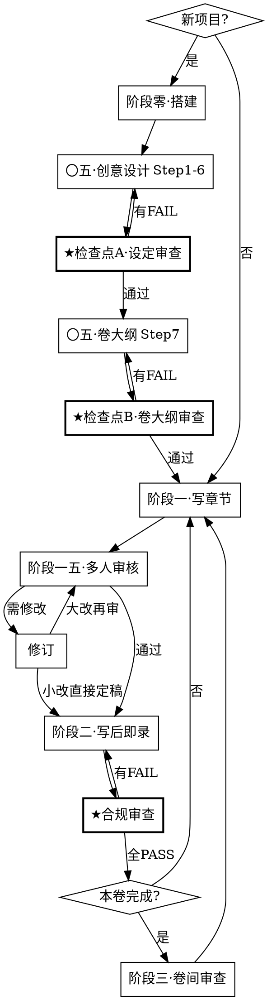
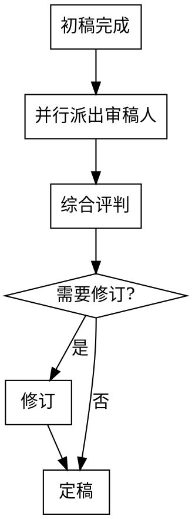

# 长篇小说写作工作流

管理百万字级长篇小说项目的完整工作流。基于纯 Markdown 文件夹，覆盖记忆系统初始化、写作技法存储、AI 上下文注入和持续维护。

## 适用场景

- 开始一个新的小说项目（初始化记忆系统）
- 用 AI 辅助写章节（上下文注入）
- 追踪伏笔、冲突、钩子、节奏
- 每章和每卷的维护更新
- **不适用**：短篇小说、非虚构写作、诗歌

## 内置参考文件

本技能自带以下参考文件，**Claude 写作时必须读取并遵循**，它们不会复制到用户项目中：

| 文件 | 路径 | 用途 |
|------|------|------|
| 记忆系统参考 | [references/memory-system.md](references/memory-system.md) | 目录结构、模板、AI 上下文策略 |
| 写作技法摘要 | [references/writing-techniques.md](references/writing-techniques.md) | 技法分类速查 |
| 伏笔类型与手法 | [references/伏笔类型与手法.md](references/伏笔类型与手法.md) | 6 种埋设手法、三拍节奏、自查清单 |
| 冲突类型手册 | [references/冲突类型手册.md](references/冲突类型手册.md) | 7 种冲突类型、升级阶梯、组合策略 |
| 悬念技法手册 | [references/悬念技法手册.md](references/悬念技法手册.md) | 4 种悬念机制、7 种章末钩子 |
| 节奏控制手册 | [references/节奏控制手册.md](references/节奏控制手册.md) | 爽点公式、张力曲线、节奏调节 |
| Scene-Sequel 模型 | [references/Scene-Sequel模型.md](references/Scene-Sequel模型.md) | Dwight Swain 场景结构 |
| MRU 参考 | [references/MRU参考.md](references/MRU参考.md) | 动机-反应单元（感受→动作→对话） |
| 叙事装置手册 | [references/叙事装置手册.md](references/叙事装置手册.md) | 信息控制、结构装置、转折装置 |
| 爽点虐点设计手册 | [references/爽点虐点设计手册.md](references/爽点虐点设计手册.md) | 爽/虐/燃/泪四种情绪点 |
| 去AI味指南 | [references/去AI味指南.md](references/去AI味指南.md) | 高频废词、AI句式、感官检查、自查清单 |
| 设定整合审查 | [references/设定整合审查.md](references/设定整合审查.md) | 检查点 A：逻辑一致性、角色-剧情匹配、可写性 |
| 卷大纲审查 | [references/卷大纲审查.md](references/卷大纲审查.md) | 检查点 B：技法、设定一致性、读者体验 |
| 写后即录合规审查 | [references/写后即录合规审查.md](references/写后即录合规审查.md) | 7 项机械化存在性/一致性检查 |
| Lint 规则目录 | [references/lint-规则目录.md](references/lint-规则目录.md) | CH-*/PR-* 全部规则 ID、阈值、门禁策略 |

**使用规则**：
- 写作辅助时，根据当前任务按需读取对应教材。**去AI味指南在每次写作和审核时都必须读取**。
- 审查类文件在对应检查点触发时读取，不在写作时加载。

## 核心工作流



---

## 阶段零：一键搭建

**触发**：用户说「初始化小说项目」、「新建小说」或类似意图。

### 工作流

1. **确认目标路径**：默认当前工作目录下 `novel-memory/`，用户可指定其他路径。

2. **部署脚手架**：将本技能 `assets/` 目录的完整内容复制到目标路径。脚手架只包含**用户项目文件**（追踪表、工作表、模板、项目元数据），不包含教材。

3. **创建空目录**：确保以下子目录存在：
   ```
   10-世界观/力量体系/  地理/  历史/  社会/  规则/
   20-角色/主角/  核心角色/  次要角色/  已退场/
   35-时间线/各卷时间线/
   50-正文/卷一/
   60-素材/
   90-归档/
   style/
   continuity/
   ```

4. **初始化 Git**（如目标路径不在已有 Git 仓库内）。

5. **引导用户进入阶段〇·五**。

> **注意**：教材文件（`references/`）仅存于技能内部，Claude 写作时按需读取，永远不会复制到用户项目。

### 搭建后的用户项目结构

```
novel-memory/
├── 00-项目/                    # 元数据层
│   ├── 项目总览.md
│   ├── 写作进度.md
│   ├── 变更日志.md
│   ├── 待解决.md
│   └── 灵感池.md
├── 10-世界观/                  # 静态设定层
│   ├── 概述.md
│   ├── 力量体系/  ├── 地理/  ├── 历史/  ├── 社会/  └── 规则/
├── 20-角色/                    # 动态层
│   ├── _角色索引.md
│   ├── 主角/  ├── 核心角色/  ├── 次要角色/  └── 已退场/
├── 25-势力/
│   └── _势力索引.md
├── 30-情节/
│   └── 主线.md
├── continuity/
│   └── 章节摘要总表.md          # 全书逐章摘要，一次读取获得全书概览
├── 35-时间线/
│   ├── 世界历史线.md
│   ├── 主角经历线.md
│   └── 各卷时间线/
├── 40-大纲/
│   └── 全书大纲.md
├── 50-正文/
│   └── 卷一/
├── 60-素材/
├── 70-技法/                    # 全书级追踪（其余技法在卷大纲中）
│   └── 伏笔/伏笔追踪表.md
├── 90-归档/
├── style/
│   └── 风格指南.md              # 阶段〇·五 Step 6 从模板创建；文风定位、标杆范文、禁忌风格、对话规范
└── _模板/
    ├── 角色模板.md
    ├── 章节模板.md
    ├── 势力模板.md
    ├── 地点模板.md
    ├── 风格指南模板.md
    └── 卷大纲模板.md
```

---

## 阶段〇·五：创意设计

**触发**：搭建完成后自动进入，或用户说「设计小说」「创建世界观」「设计角色」。

这一阶段是从空模板到可写作状态的桥梁。**先 Read 后 Write**——所有已存在的模板文件必须先读取再覆写。

### 工作流

**Step 1：项目定义**
- 与用户确认题材、基调、目标字数、分卷计划
- 填写 `00-项目/项目总览.md`

**Step 2：世界观设计**
- 填写 `10-世界观/概述.md`（一页纸世界观）
- 按需创建子文件：力量体系、地理、历史、社会规则等

**Step 3：角色创建**
- 从 `_模板/角色模板.md` 复制，为主角和每个核心角色**各建一个独立文件**
- 更新 `20-角色/_角色索引.md`
- 至少完成：主角文件 + 2-3 个核心角色文件

**Step 4：情节主线**
- 填写 `30-情节/主线.md`（核心冲突、主线阶段、活跃情节线）

**Step 5：全书大纲**
- 填写 `40-大纲/全书大纲.md`（分卷概述、每卷章节分配）

**Step 6：写作风格指南**
- 从 `_模板/风格指南模板.md` 复制到 `style/风格指南.md`
- 与用户确认文风定位、句式倾向、禁忌风格
- 填写对话规范（引号类型、标签频率、角色语言分层）
- 填写场景描写规范
- 如有标杆范文，粘贴到范文区

### ★ 检查点 A：设定整合审查

> Step 1-6 全部完成后、进入卷大纲之前执行。详见 `references/设定整合审查.md`。

读取 `references/设定整合审查.md`，并行启动 3 个审查子代理：
1. **逻辑一致性审查**：世界规则自洽、地理历史匹配、时间线可行
2. **角色-剧情匹配审查**：角色必要性、动机驱动、弧线可行性、能力匹配
3. **可写性审查**：体量匹配、冲突可持续、新鲜感储备、卡点预警

有 FAIL → 修复后重审。全 PASS → 进入 Step 7。

---

**Step 7：卷大纲（关键步骤）**
- 从 `_模板/卷大纲模板.md` 复制，创建当前卷大纲（如 `40-大纲/卷一大纲.md`）
- **必须读取以下教材**并应用到卷大纲中：

  | 卷大纲区域 | 必须读取的教材 |
  |-----------|---------------|
  | 冲突设计 | `references/冲突类型手册.md` |
  | 伏笔规划 | `references/伏笔类型与手法.md` |
  | 钩子分布 | `references/悬念技法手册.md` |
  | 节奏规划 | `references/节奏控制手册.md` + `references/Scene-Sequel模型.md` |
  | 情绪事件 | `references/爽点虐点设计手册.md` |
  | 叙事装置 | `references/叙事装置手册.md` |

- 完成卷大纲模板中的**所有检查清单**（冲突检查、伏笔检查、钩子检查、节奏检查、情绪检查）

### ★ 检查点 B：卷大纲审查

> 卷大纲完成后、进入章节写作之前执行。详见 `references/卷大纲审查.md`。

读取 `references/卷大纲审查.md`，并行启动 3 个审查子代理：
1. **技法审查**：冲突层级、伏笔双重功能、钩子交替、节奏曲线、情绪分布、叙事装置
2. **设定一致性审查**：章节事件 vs 世界规则、角色行为 vs 人设、时间线、前卷衔接
3. **读者体验审查**：开篇吸引力、粘性、高潮设计、卷尾留存

有 FAIL → 修改卷大纲后重审。全 PASS → 进入阶段一。

---

## 阶段一：章节写作

**触发**：用户说「写第X章」「继续写」或类似意图。

### 写前准备工作流

1. **加载上下文**（按以下顺序读取，注意 token 预算）：

   ```
   [永久上下文]  ~2500 tokens（固定，不随章节数增长）
     项目总览.md + 世界观概述
     style/风格指南.md（文风约束、对话规范、禁忌风格）
     所有已完成卷的「卷摘要」（从各卷大纲头部获取，每卷 ≤500 字）

   [本章上下文]  ~5000 tokens（有界，只加载必要切片）
     当前卷大纲（获取本章的概要、张力、Scene/Sequel 类型）
     continuity/章节摘要总表.md（一次读取获得全书概览，不用逐个开章节文件）
     出场角色：只读 frontmatter「摘要」字段 + 「动态状态」区（不读全文！）
       ↳ 需要深入描写某角色时才读取完整角色文件
     涉及地点摘要
     30-情节/主线.md：只读「活跃情节线」一节（跳过已完结情节线）

   [技法约束]  ~1000 tokens（从卷大纲提取）
     本章节奏定位（从卷大纲张力曲线获取）
     伏笔指令（从卷大纲获取本章该埋/强化/回收哪些伏笔）
     钩子指令（从卷大纲获取本章钩子类型）
     冲突推进备注
   ```

   **加载红线**：上下文总量控制在 ~10000 tokens 以内（不含教材）。上述三块基础预算约 8500 tokens，剩余 ~1500 tokens 为深读角色文件或额外地点信息预留。如果出场角色超过 5 人，只加载与本章有互动的角色。

2. **必读教材**：每次写作前**必须**读取 `references/去AI味指南.md`。

3. **按需读取教材**：

   | 写作任务 | 读取教材 |
   |----------|----------|
   | 埋设或回收伏笔 | 伏笔类型与手法 |
   | 设计章节冲突 | 冲突类型手册 |
   | 设计章末结尾 | 悬念技法手册 |
   | 规划多章节奏 | 节奏控制手册 |
   | 写动作/战斗场景 | Scene-Sequel 模型 + MRU 参考 |
   | 使用叙事装置 | 叙事装置手册 |
   | 设计爽点/虐点 | 爽点虐点设计手册 |

### 写作工作流

4. **创建章节文件**：复制 `_模板/章节模板.md` 到 `50-正文/卷X/章XXX.md`，填写 frontmatter
5. **写初稿**：按卷大纲的章节概要、Scene/Sequel 类型、技法约束写作。**写作过程中必须遵守以下防翻车指令**：

   ```
   防翻车指令（硬约束，不可违反）：
   ① 所有内容必须发生在卷大纲规定的本章节拍范围内，不得新增计划外事件
   ② 充分展开给定的情节节拍，不要急于推进到下一个剧情点
   ③ 在卷大纲指定的情节节拍处结束场景，不要自行延伸
   ④ 严格按照角色文件中的说话风格和已知信息边界写对话
   ⑤ 每个场景只允许植入 1 条设定信息，且必须通过角色行为或对话自然带出
   ⑥ 动作场景中不得插入超过 1 句的世界观/背景说明
   ```

6. **将 frontmatter `状态` 设为 `初稿`**
7. **进入阶段一·五（多人审核）**

---

## 阶段一·五：多人审核

**触发**：章节初稿完成后自动进入。初稿不是定稿，每章必须经过多角度审核。

### 审核工作流



**Step 1：并行派出审稿人**

使用 Agent 工具并行启动多个子代理，每人从不同角度审查初稿。每个审稿人需读取：初稿 + 卷大纲 + 对应教材。

| 审稿人 | 审查焦点 | 需读取的教材 |
|--------|----------|-------------|
| 剧情审稿人 | 情节逻辑、冲突推进、是否符合卷大纲、伏笔执行情况 | 冲突类型手册、伏笔类型与手法 |
| 技法审稿人 | Scene/Sequel 结构、MRU 顺序、章末钩子质量、节奏匹配 | Scene-Sequel模型、MRU参考、悬念技法手册、节奏控制手册 |
| 角色审稿人 | 角色行为 in character、对话辨识度、情感弧线、关系变化合理性 | 对应角色文件 |
| 文笔审稿人 | 文风一致性、节奏感、信息密度、冗余删减、开头吸引力、AI味检测、**执行 `PR-*` lint 规则** | 爽点虐点设计手册、去AI味指南、**lint-规则目录.md**、style/风格指南.md |

每个审稿人输出格式：
```markdown
## [审稿人角色] 审稿意见

### 优点（保留）
- ...

### 问题（必须修改）
- 问题描述 + 具体位置 + 修改建议

### 建议（可选修改）
- ...

### 评分：X/10
```

**文笔审稿人额外输出**（lint 结果，格式来自 `references/lint-规则目录.md`）：
```markdown
## PR-* Lint Result
- Status: PASS | PASS_WITH_WARNINGS | BLOCKED
- Counts: error=X, warn=Y, info=Z

| Rule ID | Severity | Location | Evidence | Suggestion |
|---------|----------|----------|----------|------------|
```

**Step 2：综合评判**

汇总所有审稿人意见，按优先级分类：
1. **必须修改**：逻辑矛盾、角色崩坏、严重节奏问题、偏离卷大纲
2. **建议修改**：技法提升、文笔优化、细节增强
3. **保留优点**：确认写得好的部分，修订时不要改坏

**Step 3：修订**

根据综合评判修订初稿：
- 小问题（文笔、细节）：修订后直接定稿
- 结构性大改（情节逻辑、角色行为）：修订后再跑一轮快速审核（仅审查修改部分）

**Step 4：定稿**

将章节 frontmatter `状态` 改为 `定稿`，进入阶段二。

---

## 阶段二：写后即录

**触发**：章节定稿后**立即执行**。延迟记录 = 信息丢失，不可跳过。

### 工作流

1. **章节 frontmatter**：填写字数、出场角色、一句话摘要（≤200 字，供后续章节的 AI 上下文使用）
2. **章节摘要总表**：将本章摘要追加到 `continuity/章节摘要总表.md`（格式：`| 章号 | 摘要 | 出场角色 | 关键事件标签 |`）
3. **角色文件**：如有修为/关系/状态变化，更新对应角色文件。**必须更新「动态状态」区**（当前位置、身体状态、情绪状态、已知信息、未知信息、持有物品）
4. **时间线**：在 `35-时间线/` 对应文件中添加本章事件
5. **伏笔追踪**：本章埋了新伏笔 → 登记 `70-技法/伏笔/伏笔追踪表.md`（只在「活跃伏笔」区操作）；回收了旧伏笔 → 移至「已回收」区
6. **卷大纲同步**：在当前卷大纲中更新钩子分布、情绪事件等实际执行情况
7. **情节线更新**：更新 `30-情节/主线.md` 中活跃情节线的进展。已完结的情节线移至「已完结情节线」区

### ★ 合规审查（写后即录完成后必须执行）

> 详见 `references/写后即录合规审查.md`。

读取 `references/写后即录合规审查.md`，启动 1 个合规审查子代理（只读权限），机械化验证：路径与命名（CH-PATH）、模板结构（CH-TPL）、frontmatter 完整性（CH-FM）、跨文件同步（CH-SYNC）、设定变更闭环（CH-CHECK）。

有 FAIL → 补充后重新审查。全 PASS → 进入下一章或卷间审查。

---

## 阶段三：卷间审查

**触发**：本卷所有章节定稿后执行。

### 工作流

**Step 1：一致性检查**（可并行派出子代理）
- 角色状态一致性：遍历所有角色文件，验证修为/关系/状态变化时间线
- 时间线连贯性：检查事件先后顺序、时间间隔合理性
- 设定一致性：验证世界观规则未被违反

**Step 2：技法审计**
- [ ] 伏笔清算：已埋的是否都有回收计划？
- [ ] 钩子分布：有无连续 3 章以上同类型？
- [ ] 冲突升级：张力是否在逐卷上升？
- [ ] 情绪曲线：爽/虐/燃/泪分布是否均衡？

**Step 3：生成卷摘要**
- 在当前卷大纲的 `## 卷摘要` 区填写 ≤500 字的卷摘要，覆盖：
  - 本卷主线推进（起始→结束状态）
  - 关键转折点
  - 新引入的重要角色/设定
  - 未解决的悬念（供下一卷使用）
- 将卷大纲 frontmatter `状态` 改为 `已完稿`

**Step 4：更新与归档**
- 更新 `00-项目/变更日志.md` 记录重大设定修改
- 更新 `00-项目/写作进度.md`
- 在 `continuity/章节摘要总表.md` 中添加新卷的表头
- 创建下一卷大纲（从 `_模板/卷大纲模板.md` 复制，重复阶段〇·五 Step 7）
- 提交 + 打标签：`git tag v1-卷一完稿`

---

## 速查表

| 需要做什么 | 去哪里 |
|------------|--------|
| 启动新项目 | 阶段零·一键搭建 |
| 设计世界观/角色/大纲 | 阶段〇·五·创意设计 |
| 写一章 | 阶段一·章节写作 |
| 审核章节 | 阶段一·五·多人审核 |
| 章节定稿后记录 | 阶段二·写后即录 |
| 写完一卷 | 阶段三·卷间审查 |
| 学习伏笔技法 | `references/伏笔类型与手法.md`（skill 内部） |
| 学习冲突设计 | `references/冲突类型手册.md`（skill 内部） |
| 学习悬念/钩子 | `references/悬念技法手册.md`（skill 内部） |
| 学习节奏控制 | `references/节奏控制手册.md`（skill 内部） |
| 学习场景结构 | `references/Scene-Sequel模型.md`（skill 内部） |
| 学习叙事装置 | `references/叙事装置手册.md`（skill 内部） |
| 学习情绪设计 | `references/爽点虐点设计手册.md`（skill 内部） |
| 查看模板 | 用户项目 `_模板/` 目录 |

## 常见错误

| 错误 | 纠正 |
|------|------|
| 初稿直接当定稿 | 必须经过阶段一·五多人审核流程 |
| 把所有角色塞在一个文件里 | 每个角色一个文件，原子化 |
| 跳过写后即录 | 现在花 5 分钟，省去日后数小时的矛盾修复 |
| 埋伏笔不登记 | 你一定会忘。立即登记 |
| 连续 5 章用同一种钩子 | 每 10 章检查一次钩子分布日志 |
| AI 上下文一次全量灌入 | 用摘要（每个~200字），不要灌完整文件 |
| 删除废弃设定 | 移到 `90-归档/`，永远不要删除 |
| 写作时不看教材 | 根据任务类型按需读取 references/ 下的对应手册 |
| 卷大纲不填技法区 | 写作技法不写进大纲 = 摆设，必须填满所有技法区 |
| 搭建后直接写正文 | 先完成阶段〇·五创意设计，再开始写作 |
