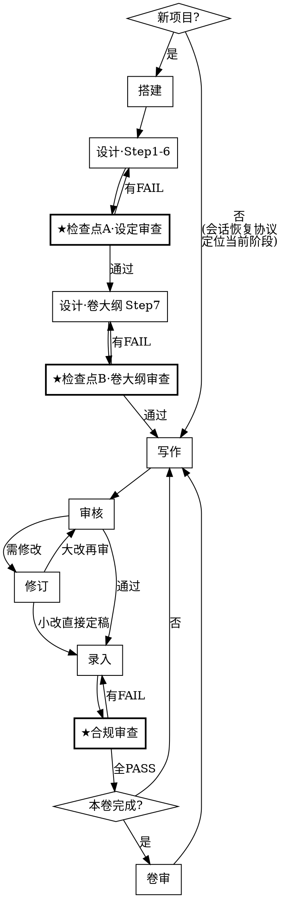

# 长篇小说写作工作流

管理百万字级长篇小说项目的完整工作流。基于纯 Markdown 文件夹，覆盖记忆系统初始化、写作技法存储、AI 上下文注入和持续维护。

## 适用场景

- 开始一个新的小说项目（初始化记忆系统）
- 用 AI 辅助写章节（上下文注入）
- 追踪伏笔、冲突、钩子、节奏
- 每章和每卷的维护更新
- **不适用**：短篇小说、非虚构写作、诗歌

## 内置参考文件

本技能自带以下参考文件，**Claude 写作时必须按需读取并遵循**，不会复制到用户项目。

### 阶段流程（主 agent 按当前阶段读取 1 个）

| 文件 | 路径 | 用途 |
|------|------|------|
| 搭建流程 | [references/搭建阶段.md](references/搭建阶段.md) | 脚手架部署、目录结构、Git 初始化 |
| 设计流程 | [references/设计阶段.md](references/设计阶段.md) | Step 1-7 + 检查点 A/B |
| 写作流程 | [references/写作阶段.md](references/写作阶段.md) | 搜集员→写手→存盘协议、黄金三章 |
| 审核流程 | [references/审核阶段.md](references/审核阶段.md) | 4 审稿人并行、综合评判、修订 |
| 录入流程 | [references/录入阶段.md](references/录入阶段.md) | 4 批次记录 + 合规审查 |
| 卷审流程 | [references/卷审阶段.md](references/卷审阶段.md) | 一致性检查、技法审计、归档 |

### 写作技法教材（子 agent 按任务按需读取）

| 文件 | 路径 | 用途 |
|------|------|------|
| 记忆系统参考 | [references/memory-system.md](references/memory-system.md) | 目录结构、模板、AI 上下文策略 |
| 写作技法摘要 | [references/writing-techniques.md](references/writing-techniques.md) | 技法分类速查 |
| 伏笔类型与手法 | [references/伏笔类型与手法.md](references/伏笔类型与手法.md) | 6 种埋设手法、三层深度、三拍节奏 |
| 冲突类型手册 | [references/冲突类型手册.md](references/冲突类型手册.md) | 7 种冲突类型、升级阶梯、组合策略 |
| 悬念技法手册 | [references/悬念技法手册.md](references/悬念技法手册.md) | 4 种悬念机制、7 种章末钩子 |
| 节奏控制手册 | [references/节奏控制手册.md](references/节奏控制手册.md) | 爽点公式、张力曲线、节奏调节 |
| Scene-Sequel 模型 | [references/Scene-Sequel模型.md](references/Scene-Sequel模型.md) | Dwight Swain 场景结构 |
| MRU 参考 | [references/MRU参考.md](references/MRU参考.md) | 动机-反应单元、展示代替叙述、对话技巧、感官描写 |
| 多线叙事手册 | [references/多线叙事手册.md](references/多线叙事手册.md) | 多主线架构、POV 管理、超长篇循环 |
| 叙事装置手册 | [references/叙事装置手册.md](references/叙事装置手册.md) | 信息控制、结构装置、转折装置 |
| 爽点虐点设计手册 | [references/爽点虐点设计手册.md](references/爽点虐点设计手册.md) | 爽/虐/燃/泪四种情绪点 |
| 去AI味指南 | [references/去AI味指南.md](references/去AI味指南.md) | AI 指纹检测、自查清单 |
| 设定整合审查 | [references/设定整合审查.md](references/设定整合审查.md) | 检查点 A：逻辑一致性、角色-剧情匹配、可写性 |
| 卷大纲审查 | [references/卷大纲审查.md](references/卷大纲审查.md) | 检查点 B：技法、设定一致性、读者体验 |
| 写后即录合规审查 | [references/写后即录合规审查.md](references/写后即录合规审查.md) | 7 项机械化存在性/一致性检查 |
| Lint 规则目录 | [references/lint-规则目录.md](references/lint-规则目录.md) | CH-*/PR-* 全部规则 ID、阈值、门禁策略 |

**使用规则**：
- 写作辅助时，根据当前任务按需读取对应教材。**去AI味指南在所有涉及文本产出的阶段都必须读取**（包括设计阶段、写作阶段、审核阶段）。
- 审查类文件在对应检查点触发时读取，不在写作时加载。

### 工作流追踪文件

本技能在关键工作流节点**强制生成追踪文件**，确保多步骤流程逐项执行、逐项打勾，杜绝遗漏。

**机制**：每个追踪文件从 `_模板/工作流-*.md` 复制到用户项目 `00-项目/工作流/` 目录，agent 按 checkbox 逐项执行并标记完成。

**状态流转**：`待执行 → 进行中 → 通过 / 未通过`

| 模板文件 | 触发时机 | 生成文件命名 |
|----------|----------|-------------|
| `_模板/工作流-检查点A.md` | Step 1-6 完成后 | `检查点A-设定审查.md` |
| `_模板/工作流-检查点B.md` | Step 7 完成后 | `检查点B-{卷名}-大纲审查.md` |
| `_模板/工作流-写前准备.md` | 每章写作前 | `写前准备-章{XXX}.md` |
| `_模板/工作流-章节审核.md` | 初稿完成后 | `章节审核-章{XXX}.md` |
| `_模板/工作流-写后即录.md` | 定稿后 | `写后即录-章{XXX}.md` |
| `_模板/工作流-合规审查.md` | 写后即录完成后 | `合规审查-章{XXX}.md` |

## 核心工作流

```dot
digraph novel_workflow {
  "新项目?" [shape=diamond];
  "搭建" [shape=box];
  "设计·Step1-6" [shape=box];
  "★检查点A·设定审查" [shape=box, style=bold];
  "设计·卷大纲 Step7" [shape=box];
  "★检查点B·卷大纲审查" [shape=box, style=bold];
  "写作" [shape=box];
  "审核" [shape=box];
  "修订" [shape=box];
  "录入" [shape=box];
  "★合规审查" [shape=box, style=bold];
  "本卷完成?" [shape=diamond];
  "卷审" [shape=box];

  "新项目?" -> "搭建" [label="是"];
  "新项目?" -> "写作" [label="否\n(会话恢复协议\n定位当前阶段)"];
  "搭建" -> "设计·Step1-6";
  "设计·Step1-6" -> "★检查点A·设定审查";
  "★检查点A·设定审查" -> "设计·卷大纲 Step7" [label="通过"];
  "★检查点A·设定审查" -> "设计·Step1-6" [label="有FAIL"];
  "设计·卷大纲 Step7" -> "★检查点B·卷大纲审查";
  "★检查点B·卷大纲审查" -> "写作" [label="通过"];
  "★检查点B·卷大纲审查" -> "设计·卷大纲 Step7" [label="有FAIL"];
  "写作" -> "审核";
  "审核" -> "录入" [label="通过"];
  "审核" -> "修订" [label="需修改"];
  "修订" -> "审核" [label="大改再审"];
  "修订" -> "录入" [label="小改直接定稿"];
  "录入" -> "★合规审查";
  "★合规审查" -> "本卷完成?" [label="全PASS"];
  "★合规审查" -> "录入" [label="有FAIL"];
  "本卷完成?" -> "卷审" [label="是"];
  "本卷完成?" -> "写作" [label="否"];
  "卷审" -> "写作";
}
```

### 会话恢复协议

每次新会话开始时：
1. 读取 `00-项目/项目索引.md` — 一次获取全局状态（进度、角色路径、活跃伏笔等）
2. 扫描 `00-项目/工作流/` 目录中 `状态: 进行中` 的工作流文件
3. 有进行中文件 → 从中断的清单项继续执行
4. 无进行中文件 → 根据项目索引的当前进度确定下一步
5. 根据当前阶段读取对应流程文件：

| 当前阶段 | 读取文件 |
|----------|----------|
| 搭建 | `references/搭建阶段.md` |
| 设计 | `references/设计阶段.md` |
| 写作 | `references/写作阶段.md` |
| 审核 | `references/审核阶段.md` |
| 录入 | `references/录入阶段.md` |
| 卷审 | `references/卷审阶段.md` |

---

## 搭建阶段

**触发**：用户说「初始化小说项目」、「新建小说」或类似意图。
**核心约束**：教材仅存于技能内部，永不复制到用户项目。`manuscript/` 与 `novel-memory/` 同级。
**流程概要**：确认路径 → 部署 `assets/` 脚手架 → 创建空目录树 → 初始化 Git → 引导进入设计阶段。

→ 详见 `references/搭建阶段.md`

## 设计阶段

**触发**：搭建完成后自动进入，或用户说「设计小说」「创建世界观」「设计角色」。
**核心约束**：先 Read 后 Write；进入前必读 `references/去AI味指南.md`。
**流程概要**：Step 1-6（项目定义→世界观→角色→情节→大纲→风格）→ 检查点 A → Step 7 卷大纲（7a/7b/7c 三子步骤）→ 检查点 B。

→ 详见 `references/设计阶段.md`

## 写作阶段

**触发**：用户说「写第X章」「继续写」或类似意图。
**核心约束**：双通道——快写通道（写手）只守硬约束，审核通道（审核+录入）兜底。全书第 1 章张力下限 ★★★★☆。任何导出到 `manuscript/` 的文本必须经过审核阶段 + 录入阶段 + 合规审查。
**流程概要**：主 agent 调度搜集员组装上下文包（含灵感池检查）→ 写手逐场景存盘写初稿 → 进入审核阶段。

→ 详见 `references/写作阶段.md`

## 审核阶段

**触发**：章节初稿完成后自动进入。
**核心约束**：初稿不是定稿，每章必审。黄金三章（全书前 3 章 / 新卷前 2 章）加严审查。偏离大纲区分「无意识跑偏」与「有意识改进」。
**流程概要**：保存初稿快照 → 读者体验快审 → 并行 4 审稿人（剧情/技法/角色/文笔）→ 综合评判 → 修订或定稿。

→ 详见 `references/审核阶段.md`

## 录入阶段

**触发**：章节定稿后立即执行，不可跳过。
**核心约束**：延迟记录 = 信息丢失。4 批次顺序执行（同批次内并行）。合规审查全 PASS 才能继续。
**流程概要**：Batch 1 frontmatter → Batch 2 摘要/伏笔/情节/术语 → Batch 3 角色/时间线/大纲同步（偏离时提示用户确认）→ Batch 4 导出正文/更新索引 → ★ 合规审查。

→ 详见 `references/录入阶段.md`

## 卷审阶段

**触发**：本卷所有章节定稿后执行。
**核心约束**：伏笔必须有回收计划；钩子不得连续 3 章同类型；张力逐卷上升。
**流程概要**：一致性检查（角色/时间线/设定/术语/文风）→ 技法审计 → 生成卷摘要 → 更新归档 + 创建下一卷大纲。

→ 详见 `references/卷审阶段.md`

---

## 速查表

| 需要做什么 | 去哪里 |
|------------|--------|
| 启动新项目 | `references/搭建阶段.md` |
| 设计世界观/角色/大纲 | `references/设计阶段.md` |
| 写一章 | `references/写作阶段.md` |
| 审核章节 | `references/审核阶段.md` |
| 章节质检 / Lint | `references/审核阶段.md`（文笔审稿人执行 `PR-*`）+ `references/lint-规则目录.md` |
| 章节定稿后记录 | `references/录入阶段.md` |
| 写完一卷 | `references/卷审阶段.md` |
| 学习伏笔技法 | `references/伏笔类型与手法.md` |
| 学习冲突设计 | `references/冲突类型手册.md` |
| 学习悬念/钩子 | `references/悬念技法手册.md` |
| 学习节奏控制 | `references/节奏控制手册.md` |
| 学习场景结构 | `references/Scene-Sequel模型.md` |
| 学习多线叙事/超长篇结构 | `references/多线叙事手册.md` |
| 学习叙事装置 | `references/叙事装置手册.md` |
| 学习情绪设计 | `references/爽点虐点设计手册.md` |
| 查看模板 | 用户项目 `_模板/` 目录 |

## 常见错误

| 错误 | 纠正 |
|------|------|
| 初稿直接当定稿 | 必须经过审核阶段多人审核流程 |
| 把所有角色塞在一个文件里 | 每个角色一个文件，原子化 |
| 跳过写后即录 | 现在花 5 分钟，省去日后数小时的矛盾修复 |
| 埋伏笔不登记 | 你一定会忘。立即登记 |
| 连续 5 章用同一种钩子 | 每 10 章检查一次钩子分布日志 |
| AI 上下文一次全量灌入 | 用摘要（每个~200字），不要灌完整文件 |
| 删除废弃设定 | 移到 `90-归档/`，永远不要删除 |
| 写作时不看教材 | 根据任务类型按需读取 references/ 下的对应手册 |
| 卷大纲不填技法区 | 写作技法不写进大纲 = 摆设，必须填满所有技法区 |
| 搭建后直接写正文 | 先完成设计阶段，再开始写作 |
