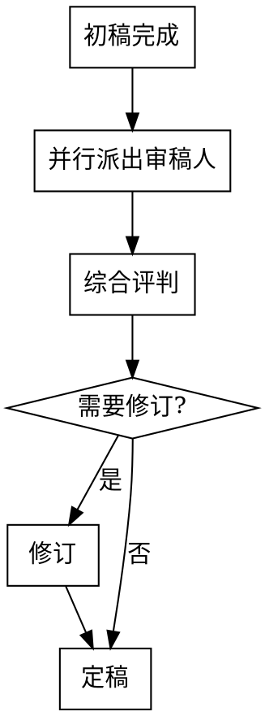

# 审核阶段

**触发**：章节初稿完成后自动进入。初稿不是定稿，每章必须经过多角度审核。

> **工作流激活**：复制 `_模板/工作流-章节审核.md` → `00-项目/工作流/章节审核-章{XXX}.md`，按追踪文件逐项执行。

**架构**：主 agent 调度审稿人子 agent，审稿人从磁盘文件获取上下文（章节文件 + 教材），主 agent 只收审稿意见摘要。

## 审核工作流



**Step 0：保存初稿快照**

将当前章节文件完整复制到版本历史目录（保留 frontmatter 和所有元数据区块）：
```
50-正文/卷X/章XXX.md → 50-正文/卷X/_历史/章XXX-v1-初稿.md
```

**Step 0.5：读者体验快审（只看前 500 字，先把"抓人"卡住）**

在派审稿人之前，先做一轮轻量快审，避免后续"越审越正确，越改越不抓人"：

- 提取并写在综合评判里：`目标/阻碍/代价或时钟/读者问题`
- 对照 `55-风格/风格指南.md` 的"阅读体验偏好"，检查开篇强度与解释密度是否匹配
- **门禁规则**：若为 `章001` 或新卷开篇，四项任一缺失 → 直接加入「必须修改」

## 黄金三章加严审查

全书前 3 章 / 新卷前 2 章额外执行：

| 检查项 | 不通过条件 | 处理 |
|--------|-----------|------|
| 即时共情 | 前 500 字无法让读者对主角产生情感反应 | 必须修改 |
| 术语密度 | 第 1 章前 500 字引入 ≥3 个新术语 | 必须修改 |
| 钩子前置 | 全书第 1 章的核心危机/悬念在前 1/3 篇幅内零暗示 | 必须修改 |
| 张力匹配 | 全书第 1 章实际张力 < ★★★★☆ | 必须修改 |
| 黄金承诺 | 前 3 章结束后读者无法回答"主角要做什么、为什么、做不到会怎样" | warn（第 3 章审核时检查） |

## Step 1：并行派出 4 个审稿人 Agent

使用 Agent 工具并行启动 4 个子代理。每个审稿人 prompt 中**明确指定需从磁盘读取的文件路径**，审稿人自行读取文件获取上下文。

| 审稿人 | 审查焦点 | 从磁盘读取的文件 |
|--------|----------|-----------------|
| 剧情审稿人 | 情节逻辑、冲突推进、卷大纲符合度（区分跑偏 vs 改进）、伏笔执行情况 | 章节文件 + 卷大纲 + `references/冲突类型手册.md` + `references/伏笔类型与手法.md` |
| 技法审稿人 | Scene/Sequel 结构、MRU 顺序、章末钩子质量、节奏匹配 | 章节文件 + 卷大纲 + `references/Scene-Sequel模型.md` + `references/MRU参考.md` + `references/悬念技法手册.md` + `references/节奏控制手册.md` |
| 角色审稿人 | 角色行为 in character、对话辨识度、情感弧线、关系变化合理性 | 章节文件 + 出场角色文件（路径从 `00-项目/项目索引.md` 获取） |
| 文笔审稿人 | 文风一致性、节奏感、信息密度、冗余删减、开头吸引力、AI味检测、**执行 `PR-*` lint 规则** | 章节文件 + `references/爽点虐点设计手册.md` + `references/去AI味指南.md` + `references/lint-规则目录.md` + `55-风格/风格指南.md` |

> **角色审稿人特别说明**：主 agent 在 prompt 中提供出场角色文件路径（从项目索引获取），审稿人自行从磁盘读取角色文件。

每个审稿人输出格式：
```markdown
## [审稿人角色] 审稿意见

### 优点（保留）
- ...

### 问题（必须修改）
- 问题描述 + 具体位置 + 修改建议

### 建议（可选修改）
- ...

### 评分：X/10
```

**剧情审稿人额外输出**（大纲偏离判定）：
```markdown
### 大纲偏离分析
| 偏离点 | 类型 | 说明 |
|--------|------|------|
| [具体偏离] | 无意识跑偏 / 有意识改进 | [判断依据] |
```
- **无意识跑偏**（遗忘大纲设定、逻辑矛盾）→ 归入「必须修改」
- **有意识改进**（故事走向比大纲更好、角色发展更自然）→ 归入「大纲变更建议」，由用户确认

**文笔审稿人额外输出**（lint 结果，格式来自 `references/lint-规则目录.md`）：
```markdown
## PR-* Lint Result
- Status: PASS | PASS_WITH_WARNINGS | BLOCKED
- Counts: error=X, warn=Y, info=Z

| Rule ID | Severity | Location | Evidence | Suggestion |
|---------|----------|----------|----------|------------|
```

**文笔审稿人附加（读者体验项）**：
- 只看前 500 字，写出：目标/阻碍/代价或时钟/读者问题（各 1 句，禁止写成设定说明）
- 判断开篇钩子类型（好奇/紧张/期待/意外/情感）与强度是否符合风格指南

## Step 2：综合评判

主 agent 汇总所有审稿人返回的意见（短文本），按优先级分类：
1. **必须修改**：逻辑矛盾、角色崩坏、严重节奏问题、无意识跑偏（遗忘/矛盾大纲设定）
2. **大纲变更建议**：偏离卷大纲但故事走向更好（剧情审稿人标注为「有意识改进」）→ 询问用户：保留当前写法还是回退到大纲原案？用户选择保留 → 标记「待同步」，录入阶段 Batch 3 执行大纲更新
3. **建议修改**：技法提升、文笔优化、细节增强
4. **保留优点**：确认写得好的部分，修订时不要改坏

## Step 3：修订

将 frontmatter `状态` 改为 `修改`，修订由主 agent 或新启动的写手 Agent 执行：
- 小问题（文笔、细节）：主 agent 直接修订后定稿
- 结构性大改（情节逻辑、角色行为）：启动写手 Agent 修订，修订后再跑一轮快速审核（仅审查修改部分）

**每次修订后保存快照**（版本号递增）：
```
50-正文/卷X/章XXX.md → 50-正文/卷X/_历史/章XXX-v{N}-修订{N-1}.md
```

## Step 4：定稿

将章节 frontmatter `状态` 改为 `定稿`，进入录入阶段。
